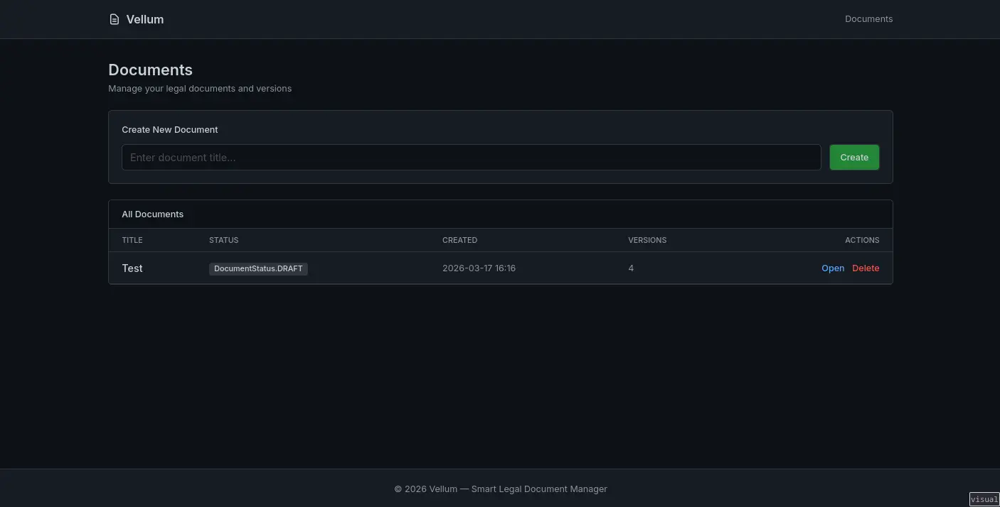
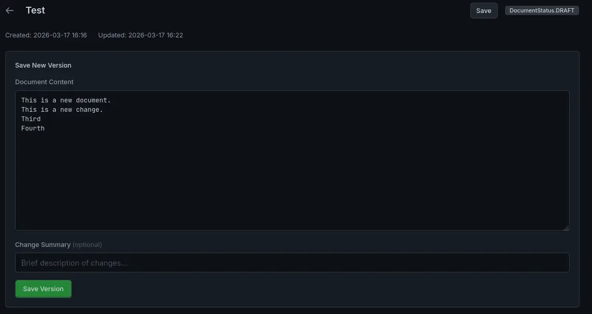
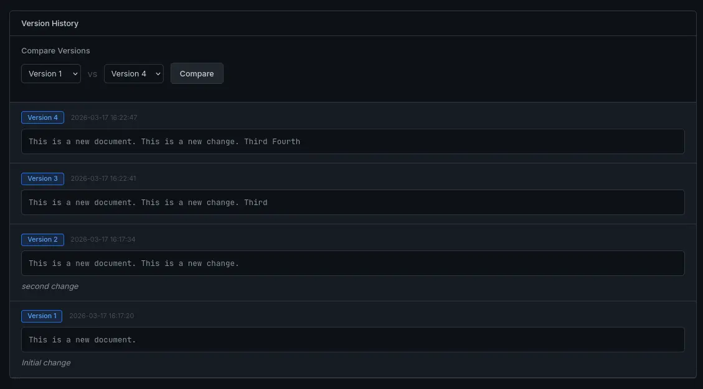

# Vellum - Smart Legal Document Manager

A modern web application for managing legal documents with intelligent version control, duplicate detection, and side-by-side version comparison.

## Images




## Features

- **Document Management**: Create, edit, and delete legal documents with metadata tracking
- **Version Control**: Automatic versioning with change summaries and duplicate detection
- **Smart Duplicate Detection**: SHA-256 hashing prevents saving identical versions
- **Significance Checking**: Ignores whitespace-only changes for meaningful version tracking
- **Version Comparison**: Side-by-side diff view with HTMX-powered dynamic loading
- **Background Notifications**: Console logging for significant document changes
- **Modern UI**: Built with Tailwind CSS, HTMX, and Google Fonts

## Tech Stack

- **Backend**: FastAPI (Python)
- **Database**: SQLite with SQLAlchemy 2.0 Async (aiosqlite driver)
- **Frontend**: Jinja2 Templates + HTMX + Tailwind CSS
- **Fonts**: Inter (UI) + JetBrains Mono (code)

## Installation

```bash
# Install dependencies
uv sync

# Run the application
uv run uvicorn app.main:app --reload --host 0.0.0.0 --port 8000
```

## Development

```bash
# Run with auto-reload
uv run uvicorn app.main:app --reload

# Test imports
uv run python -c "from app.main import app; print('OK')"
```

## Docker

```bash
# Build and run with Docker Compose
docker compose up -d --build

# View logs
docker compose logs -f

# Stop the application
docker compose down
```

The application will be available at http://localhost:8000

## API Endpoints

| Method | Endpoint | Description |
|--------|----------|-------------|
| GET | `/` | Dashboard with document list |
| POST | `/documents` | Create new document |
| GET | `/documents/{id}` | Document editor page |
| POST | `/documents/{id}` | Update document title (with `?_method=PATCH`) |
| POST | `/documents/{id}/versions` | Save new version |
| DELETE | `/documents/{id}` | Delete document |
| GET | `/documents/{id}/compare?v1={id}&v2={id}` | Version comparison |
| GET | `/health` | Health check |

## Testing with cURL

```bash
# Health check
curl http://localhost:8000/health

# Create a new document
curl -X POST http://localhost:8000/documents \
  -d "title=Contract Agreement"

# View document editor (returns HTML)
curl http://localhost:8000/documents/1

# Update document title
curl -X POST "http://localhost:8000/documents/1?_method=PATCH" \
  -d "title=Updated Contract Agreement"

# Save a new version
curl -X POST http://localhost:8000/documents/1/versions \
  -d "content=This is the first version of the contract." \
  -d "change_summary=Initial version"

# Save another version (to test versioning)
curl -X POST http://localhost:8000/documents/1/versions \
  -d "content=This is the second version with changes." \
  -d "change_summary=Updated terms and conditions"

# Test duplicate detection (same content as latest)
curl -X POST http://localhost:8000/documents/1/versions \
  -d "content=This is the second version with changes." \
  -d "change_summary=Duplicate test"

# Compare two versions (returns HTML diff)
curl "http://localhost:8000/documents/1/compare?v1=1&v2=2"

# Delete a document
curl -X DELETE http://localhost:8000/documents/1
```

